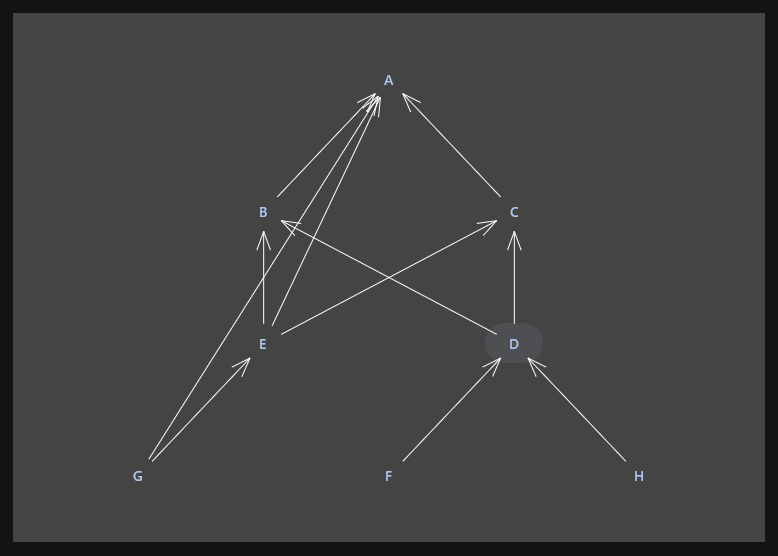

# Algorithm Application

Application to visually demonstrate algorithms:

- Graph
  - Entity Relationship - Layered graph drawing (Sugiyama-style graph drawing)

## Entity Relationship

## Run it

Run the desktop application: `./gradlew :composeApp:run`  
Run the desktop **hot reload** application: `./gradlew :composeApp:hotRunJvm`  
Run desktop UI tests: `./gradlew :composeApp:jvmTest`
